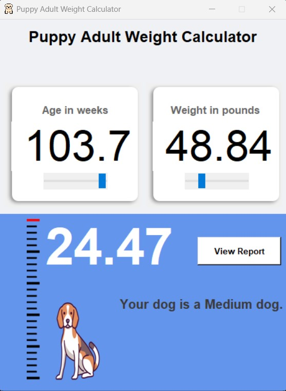

# Puppy-Adult-Weight-Calculator-Part-2-

A Python program to calculate the adult weight of puppies based on their age and weight. This interactive calculator provides insights into the expected size of your dog when they reach adulthood.

## Features

- Input the age of your puppy in weeks and their current weight in pounds.
- The program calculates the estimated adult weight based on the provided information.
- Displays a descriptive category for your dog's size (X-Small, Small, Medium, Large, or Giant).
- Interactive sliders for adjusting age and weight values.
- Visual representation of a beagle puppy that changes with the adjusted age and weight.

## Installation

1. Clone the repository or download the code files.
2. Make sure you have Python 3.x and the required libraries installed.
3. Run the Python script `puppy_weight_calculator.py` to launch the application.

## Dependencies

- `tkinter`: Python's standard GUI package for creating the user interface.
- `PIL`: Python Imaging Library for image processing and manipulation.
- `ttk`: Tkinter's themed widget set for creating stylish and modern UI elements.

## Usage

1. Launch the program.
2. Enter the age of your puppy in weeks and their current weight in pounds.
3. Adjust the sliders to see the visual representation of the puppy's growth.
4. Click the "View Report" button to calculate and display the estimated adult weight and size category.

## Screenshot

*Example screenshot of the Puppy Adult Weight Calculator*

## Contributing

Contributions are welcome! If you have any suggestions, bug reports, or feature requests, please open an issue or submit a pull request.

## License

This project is licensed under the [MIT License](LICENSE).

